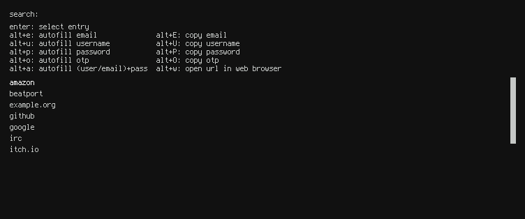
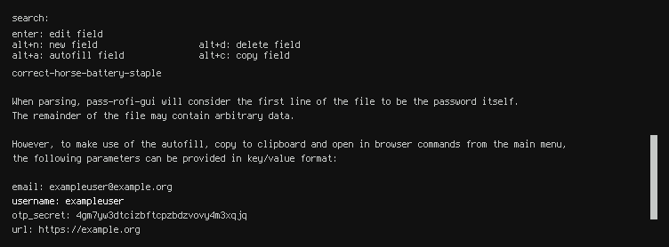

<div align="center">

# pass-rofi-gui
A [rofi](https://github.com/davatorium/rofi) GUI for the [standard unix password manager](https://passwordstore.org).

</div>

## Features

- GUI password store browser.
- Password search via normal, regex, glob and fuzzy filters.
- Convenient autofill/copy to clipboard commands for common fields.

<div align="center">

<br />

</div>

- GPG pinentry prompt via rofi.

<div align="center">

<br />

</div>

- GUI password entry viewer.
- Support for arbitrary UTF-8 data in password entry files.

<div align="center">

<br />

</div>

- GUI prompt for editing fields.

<div align="center">

<br />

</div>

- Actively used and maintained. Feel free to [open an issue](https://github.com/alecdwm/pass-rofi-gui/issues/new) or [get in touch](https://owls.io) for any questions / feature requests.

## Installation
#### Dependencies
**Binaries**
- [pass](https://www.passwordstore.org) (the password store)
- [rofi](https://github.com/davatorium/rofi) (draws the GUI)
- [xclip](https://github.com/astrand/xclip) (copies data to the clipboard)
- [xdotool](https://www.semicomplete.com/projects/xdotool) (autofills data)
- [xwininfo](http://www.xfree86.org/4.2.0/xwininfo.1.html) (selects the target window for autofill)

**Libraries**
- libdbus-1 is required for desktop notifications

#### Binary installation
1. Make sure you have all the required dependencies.
2. Grab the latest binary from the [releases](https://github.com/alecdwm/pass-rofi-gui/releases) page.
3. Put `pass-rofi-gui` somewhere in your `$PATH`.
4. (Optionally) create a keybinding in your desktop environment to launch `pass-rofi-gui`.

#### Building from source
1. Install [rustup](https://www.rust-lang.org/tools/install).
2. Install the latest stable rust toolchain with `rustup toolchain install stable`.
3. Clone the project locally with `git clone git@github.com:alecdwm/pass-rofi-gui.git`.
4. Change to the cloned directory with `cd pass-rofi-gui`.
5. Build the project with `cargo build --release`.
6. Copy the binary from `target/release/pass-rofi-gui` to somewhere in your `$PATH`.
7. (Optionally) create a keybinding in your desktop environment to launch `pass-rofi-gui`.

## Usage
```shell
$ pass-rofi-gui --help
pass-rofi-gui 1.1.0
alecdwm <alec@owls.io>
A rofi GUI for the standard unix password manager.

USAGE:
    pass-rofi-gui [FLAGS] [OPTIONS]

FLAGS:
    -h, --help         Prints help information
        --no-notify    Disables desktop notifications
    -V, --version      Prints version information

OPTIONS:
        --browser <browser>                          Sets the browser for opening URLs [env: BROWSER=]
        --password-store-dir <password-store-dir>
            Overrides the default password storage directory [env: PASSWORD_STORE_DIR=]

        --rofi-matching <rofi-matching>
            Sets the rofi matching method [default: normal]  [possible values: normal, regex, glob, fuzzy]
```
